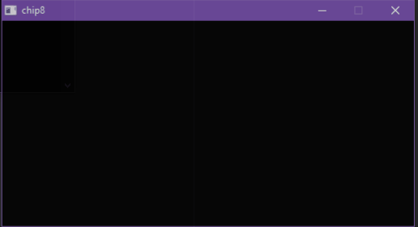

# CHIP-8 Interpreter
CHIP-8 Interpreter is a cross platform application to run chip-8 roms. 
This was written in C++ using SDL2.

|  Function | Implementation |
| ------------- | ------------- |
| Opcodes  | Completed ✅   |
| Rendering  | Completed ✅   |
| Audio  | Working with issues ⚠️  |
| Input  | Completed ✅   |
 

## Known Issues

- Currently audio is running on the same thread as the core. When audio is triggered the core will lag for one cycle
- Core speed is not accurate. Currently the core is sleeping for 16 milliseconds after every cycle to roughly reach 60 cycles per second.

## Future work

- Refactor improper C++. Code base does not follow best practices and leaves lot of room for imrpovement.
- Refactor the massive switch statement of Opcodes to instead use function pointers.
- Implement Super CHIP-8 Opcodes

### References

- http://www.multigesture.net/articles/how-to-write-an-emulator-chip-8-interpreter/
