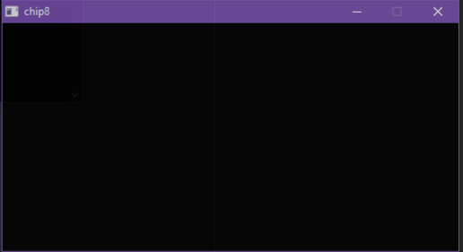

# CHIP-8 Interpreter

A cross-platform CHIP-8 interpreter for running CHIP-8 ROMs, written in C++ using SDL2.

| Function  | Status   |
| --------- | -------- |
| Opcodes   | Complete |
| Rendering | Complete |
| Audio     | Complete |
| Input     | Complete |



## Usage

The ROM to run is passed as the first argument:

```
chip8_interpreter <rom>
```

### Controls

The original CHIP-8 keypad is mapped to the left side of the keyboard:

```
CHIP-8        Keyboard
1 2 3 C       1 2 3 4
4 5 6 D       Q W E R
7 8 9 E       A S D F
A 0 B F       Z X C V
```

The CPU runs at a fixed clock of 700Hz while the display and timers run at 60Hz, both driven by the real elapsed time so the speed stays consistent across machines. The clock rate can be adjusted with the `cpuClockHz` constant in `main.cpp`.

## Future Work

- Replace the large opcode switch statement with a function pointer table.
- Implement the Super CHIP-8 opcodes.

## References

- http://www.multigesture.net/articles/how-to-write-an-emulator-chip-8-interpreter/
